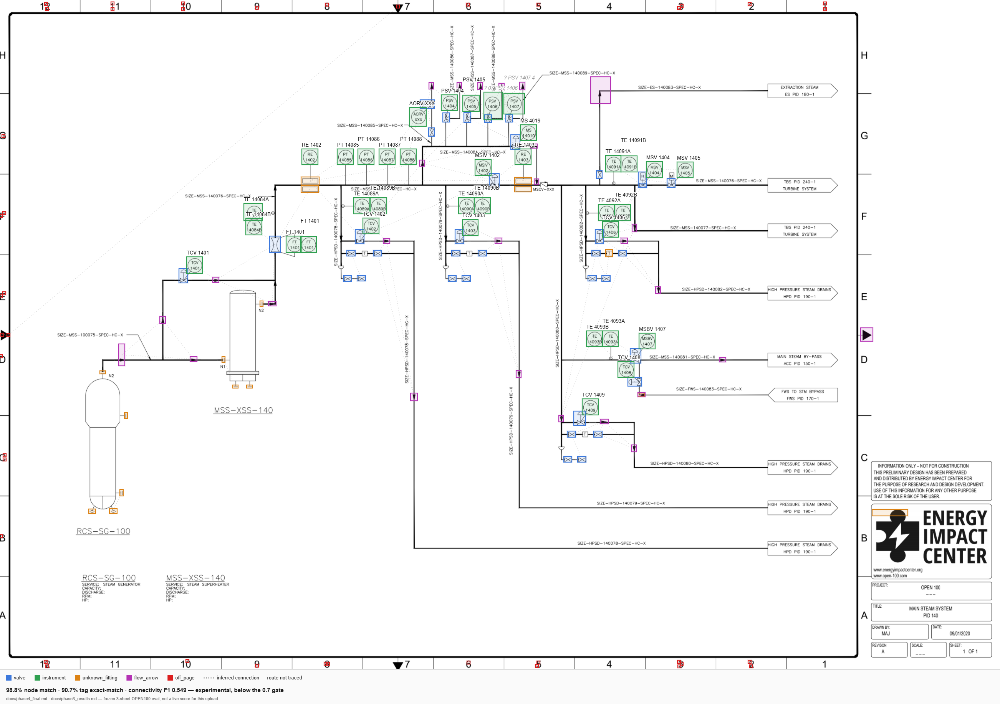

# PIDetect — Engineering Log (Dev README)

> This is the full technical record: phase gates, exact eval numbers, known residuals, and
> the commands to reproduce every result below. For the short, recruiter-facing overview,
> see [README.md](README.md). For the persistent project plan/architecture decisions Claude
> Code reads before touching this repo, see [CLAUDE.md](CLAUDE.md).

Upload a P&ID (Piping & Instrumentation Diagram) sheet → get back detected instrument/valve
symbols, their instrument tags (read via OCR), and a best-effort process **connectivity graph** —
viewable in the browser as an overlay on the original sheet, and downloadable as JSON or as an
annotated PNG. PyTorch · YOLOv11 · SAHI · PaddleOCR · NetworkX.



> Rework in progress. See `CLAUDE.md` for the full plan, architecture, and phase gates.
> This README covers the shipped v1 demo (Phase 5); `docs/phase4_final.md` and
> `docs/phase3_results.md` are the frozen evaluation records those numbers below are drawn from.

## Demo video

*(placeholder — a short screen recording of the golden path: upload → wait → overlay with tags
and graph → JSON/PNG download, on a real OPEN100 sheet, goes here.)*

## Honest metrics

No cherry-picked single number — this is what actually measures on the 3-sheet OPEN100 held-out
sample (`docs/phase4_final.md`, `docs/phase3_results.md`), reported the same way in the app's own
UI (a "frozen, not a live per-upload score" caption travels with every result, including the
exported PNG).

| Stage | Metric | Result | Gate |
|---|---|---|---|
| Symbol detection | Node-match (CtrMt@50%) | **98.8%** | ≥ 80% — met |
| Instrument tag OCR | Exact-match (ok/ok_placeholder rows) | **90.7%** | ≥ 90% — met |
| Instrument tag OCR | Micro-averaged CER | **0.0241** | — |
| Connectivity graph | F1 (precision 0.435, recall 0.775) | **0.549** | ≥ 0.70 — **not met** |

Connectivity is explicitly labeled **experimental** in the UI (a secondary, lighter, toggleable
overlay layer, never styled with the same visual confidence as a detection box) — it's below its
own gate and should not be read as authoritative. Detection and OCR are the strong, gate-passing
parts of this pipeline; connectivity is the acknowledged differentiator-in-progress.

## Known limitations

- **`flow_arrow` detection: 65.2%** node-match on OPEN100, below the 80% gate. Confirmed root
  cause: synthetic training arrows have zero size overlap with real arrows (99.8% of real arrows
  are 8–30px; synthetic ones median 79.2px). This is a training-data gap, not an architecture
  problem — fix is adding real arrow crops as synth templates, not a retrain. Did not block later
  phases; tracked separately. See `docs/arrow_triage/miss_breakdown.md`.
- **Connectivity's dominant residual: shared-header false positives** — 32 of 58 total FPs (55%)
  are two symbols each tapping perpendicularly onto a common trunk pipe, which the corridor-ink
  test can't geometrically distinguish from a dedicated point-to-point connection. No surviving
  skeleton stub after erasure, no dashed-line signal to key off — unreachable by any discriminator
  built so far. Two upstream levers (reduced erasure dilation; explicit shared-trunk detection)
  are named as future work, not started. Full detail: `docs/phase4_final.md` §5.
- **10 open cross-node-type close-prediction pairs** (`docs/phase4_final.md` §2) — valve/instrument
  detections sitting very close to an `unknown_fitting`/`flow_arrow`/`tag_rect` detection. Each
  needs individual visual judgment (a valve actuator can legitimately sit right next to an
  instrument bubble as two real objects) — deliberately NOT resolved by a blanket rule.
  Not investigated this pass.
- **~2 minutes per sheet on CPU** (measured end-to-end, OPEN100-sized sheets ~1700–2800px):
  detection ~10–20s, OCR ~75–95s (dominant cost — a spike into batching/process-pooling found no
  win, since PaddleOCR's CPU inference already saturates available compute per call; one real
  optimization — disabling unneeded doc-orientation/unwarping sub-models — gave a real but modest
  ~24% OCR reduction, already applied), graph construction ~10–20s. This rules out a synchronous
  request/response UI; the app uses an async job with polling instead. Real production sheets
  (CLAUDE.md: 5000–7000px) are untested and would likely run substantially longer.
- **81.7% of rendered connectivity edges are inferred straight chords, not traced pipe routes**
  (measured on a live sheet: 116 of 142 edges have no traceable skeleton polyline — short-gap
  ink-inferred connections and contracted-through connector/crossing edges alike). The UI marks
  these visually distinct (dotted, fainter) from the 18.3% that do have a real traced route, with
  an explicit legend entry — but it's worth knowing the split going in.
- Vessels (tanks/pumps) are not a YOLO-detected class in this pipeline yet — they appear in the
  OPEN100 evaluation only via ground-truth annotation, not in a real upload's output.
- Fine-grained valve/fitting sub-classification (Phase 2 scope) not yet started.
- Single in-memory job store, one worker — concurrent uploads serialize. Fine for a demo, not for
  production (`docs/phase5_design.md`).

## Architecture

Detection (YOLOv11 + SAHI tiling) → cross-subtype dedupe → symbol erasure → skeleton tracing →
endpoint binding + short-gap bridging → junction (connector/crossing) detection → graph
construction/contraction → instrument-tag OCR (PaddleOCR) → JSON/GraphML export. FastAPI wraps
this as an async job (`POST /jobs` → poll `GET /jobs/{id}` → `GET /jobs/{id}/result`); a minimal
React frontend polls, renders the overlay, and offers JSON/PNG downloads. Full design rationale,
scope cuts, and the latency/hosting analysis behind these choices: `docs/phase5_design.md`.

## Running the demo locally

**Python 3.12 is required for the whole project, not just OCR.** Detection (torch/ultralytics/
sahi) and OCR (paddlepaddle/paddleocr) must run in the *same* interpreter for the API to work as
one process — confirmed this session that all of them install and import together cleanly under
3.12 (paddlepaddle has no wheel for Python 3.13+, which is the only version constraint here).

```bash
python3.12 -m venv .venv312
# Windows: .venv312\Scripts\activate | macOS/Linux: source .venv312/bin/activate
pip install -r requirements.txt
```

You'll also need trained detection weights (`*.pt`, gitignored — train your own via the
Colab/Kaggle workflow below, or point `configs/phase5.yaml`'s `weights_path` at one you have).

**Backend:**
```bash
PADDLE_PDX_ENABLE_MKLDNN_BYDEFAULT=False PYTHONPATH=src \
  uvicorn pidetect.api.main:app --host 127.0.0.1 --port 8000
```
The MKLDNN env var works around a CPU inference crash confirmed on this dev machine
(`NotImplementedError: ConvertPirAttribute2RuntimeAttribute...`, paddlepaddle 3.3.1 CPU/PIR
executor) — see `docs/phase5_design.md` for detail. GPU deployments may not need it.

**Frontend:**
```bash
cd frontend
npm install
npm run dev
```
Open the printed local URL (typically `http://localhost:5173`), upload a P&ID sheet (e.g. one of
`data/realworld_eval/open100/_raw/*.png` once you've fetched OPEN100), and wait — it's slow
(see Known limitations) but real.

## Data
Public only. The Digitize-PID symbols set (`hamzas/digitize-pid-yolo`) is primary; PID2Graph
OPEN100 (Energy Impact Center) is used for connectivity/OCR evaluation and is what this README's
screenshots are drawn from. **NDA diagrams from the original hackathon project are never
committed, trained on, or used in any screenshot or doc** — confirmed for this repo: nothing
under `data/`, no `*.pt`/`*.onnx`/`*.pth` weights, and no `nda`-named files are tracked in git
(`.gitignore` excludes `/data/`, `/runs/`, weight extensions, and `nda/`/`*_nda*` explicitly).

## Quickstart — rebuild dataset from scratch

```bash
python scripts/build_dataset.py
```

Runs the full Phase 0 pipeline (download → tile → synthetic → merge) with fixed seed 42.
Produces `data/merged/` ready for Phase 1 YOLOv11 training.
Skips steps whose outputs already exist; use `--force` to rebuild everything.

## Training on Colab/Kaggle

Full training runs on a free T4/P100/A100 GPU. The script handles dataset build,
Drive caching, training, and test-split evaluation in one go.

### Google Colab (recommended)

**Cell 1** — mount Drive once per session (dataset is cached there after the first build):
```python
from google.colab import drive
drive.mount('/content/drive')
```

**Cell 2** — clone, build, train, evaluate:
```python
%cd /content
!git clone https://github.com/MalharRane/P-IDetect.git
%cd pidetect
!bash scripts/colab_setup.sh
```

First run builds the dataset (~15 min). Every subsequent session restores from Drive
in ~30 s. To force a full rebuild: `!bash scripts/colab_setup.sh --force-data`.

### Kaggle

Enable **Internet** in notebook Settings, then:
```bash
%%bash
git clone https://github.com/<your-username>/pidetect.git
cd pidetect
bash scripts/colab_setup.sh --no-drive
```

Dataset rebuilds each session (~15 min). To persist it, save the `data/` output
as a Kaggle dataset and symlink it on the next run.

### Batch size

Default is `--batch=16` (safe for T4/P100 16 GB). Override with e.g.
`!bash scripts/colab_setup.sh --batch=32` for a V100, or `--batch=64` for an A100.

### After training

The script runs evaluation automatically. To re-run manually (e.g. after downloading
`best.pt` to your laptop):
```bash
PYTHONPATH=src python -m pidetect.detect.evaluate \
  --weights runs/detect/train/weights/best.pt \
  --data    configs/yolo_baseline.yaml \
  --split   test
```

Outputs: overall mAP@50/50-95, per-class AP table (worst-first), confusion matrix PNG.

## Phase 0 Progress

- [x] 0.1 — Environment & repo baseline (venv, imports verified, git + .gitignore, this checklist)
- [x] 0.2 — Download HF dataset (`hamzas/digitize-pid-yolo`) into `data/`
- [x] 0.3 — Dataset inspection: per-class counts, sample box overlays, tile-size driver
- [x] 0.4 — Tiling pipeline: 640px / 20% overlap → 35 826 tiles across train+val
- [x] 0.5 — Synthetic generator: 200 sheets, 32-class glyph library, YOLO labels + connectivity JSON
- [x] 0.6 — One-command build: `python scripts/build_dataset.py` → train/val/test split, histogram
