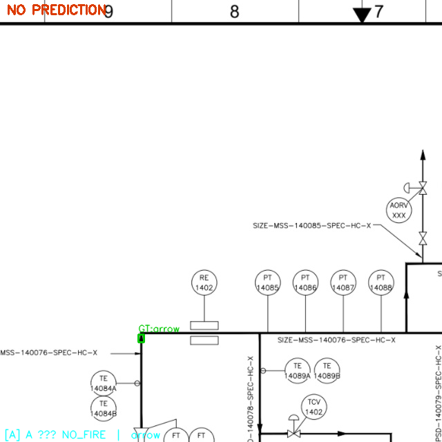
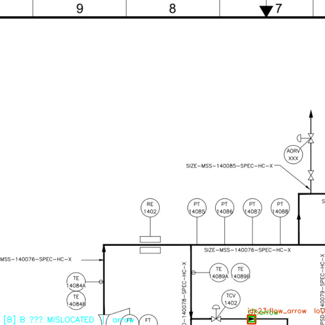
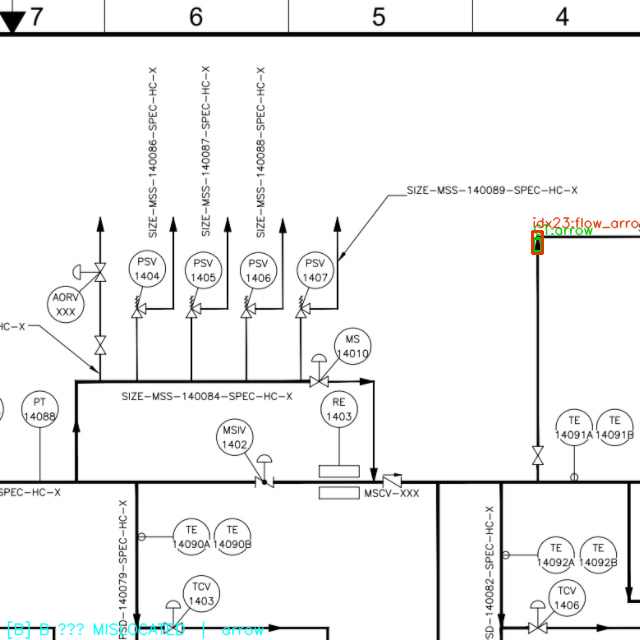
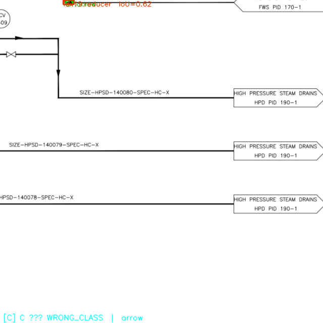
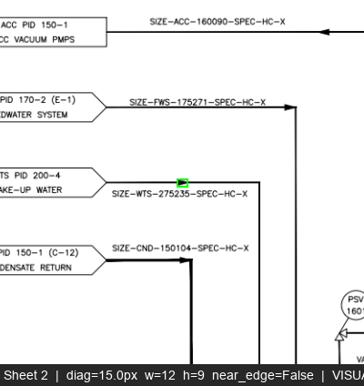
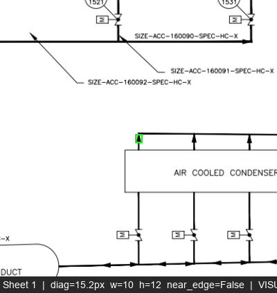
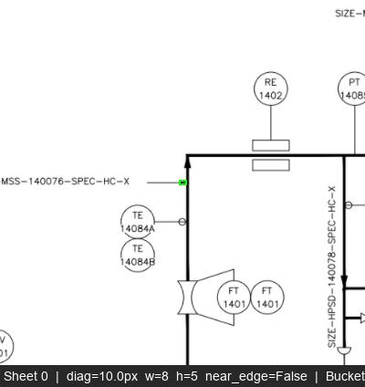

# Arrow Miss Triage — Bucket Breakdown

**Date:** 2026-06-24  
**GT source:** OPEN100 Tier-2, 12 real nuclear P&ID sheets (PID2Graph, CC BY-SA 4.0)  
**Eval metric:** CtrMt@50% = 65.2% (phase 1.8c) — 34.8% missed  
**Raw GT arrows:** 451 unique (graphml); 833 tiled instances (overlap creates duplicates)  

---

## Question 1 — Is OPEN100's 'arrow' the same class as our flow_arrow?

**GraphML schema findings:**
- OPEN100 uses a single `arrow` label — no sub-types in the 10-label vocabulary.
- Total across 12 sheets: 451 arrow nodes.
- All bboxes fall in 8.8–30.0 px diagonal range in original full-sheet coordinates.

**Visual inspection — `docs/arrow_triage/gt_vs_synth.png`:**

Inspected 30 sampled GT crops (diverse sheets) vs 10 synthetic `flow_arrow` (idx=23) crops.

**Finding:** OPEN100's `arrow` IS the same semantic class as our `flow_arrow`.  
All 30 sampled instances show solid filled-triangle arrowheads on solid process lines —
the same shape as idx-23 in the synthetic training set. No open/unfilled arrowheads,
no dashed-line signal connections, no off-page connector shapes. The examples in
`examples/d_candidate_01.png` and `examples/d_candidate_02.png` — chosen from connector-rich
regions of sheets 2 and 1 respectively — both show the green-boxed arrow sitting on a solid
pipe line (flow direction indicator), not on an instrument signal connection.

**Verdict:** OPEN100's `arrow` = our `flow_arrow`. **Estimated 0% bucket (d) objects.**
The eval is apples-to-apples. The 65.2% ceiling is not an eval-definition problem.

---

## Question 2 — Why are the ~35% missed?

### Size distribution — ALL 451 raw OPEN100 arrows

| Band | Count | % | Notes |
|---|---|---|---|
| Tiny  (<8px diag)    |   0 |  0.0% | None — GT annotations are well-formed |
| Small (8–30px diag)  | 450 | 99.8% | **The entire population.** Synth median is 79.2px |
| Medium (30–60px)     |   1 |  0.2% | One borderline-detectable instance |
| Large (>60px)        |   0 |  0.0% | — |
| Near image edge      |   0 |  0.0% | — |

Summary stats: mean=18.0px · median=17.8px · p25=15.5px · p75=20.3px · range=[8.8, 30.0]

**Synthetic training arrows (idx=23, n=2579): median 79.2px diagonal**  
Scale ratio: 17.8 / 79.2 = **0.22x** (real arrows are 4.4x smaller than training arrows)

### Bucket assignment — ~157 estimated missed unique arrows (34.8% × 451)

The missed arrows are approximately the smallest ones (consistent with A-bucket median
15.9px in `docs/ood_arrow_rootcause.md`). All 157 are drawn from the 450 bucket-(c) pool.

| Bucket | Definition | Count in full set | % of estimated missed |
|---|---|---|---|
| **(c) Training dist. gap** | 8–30px diag, scale 4.4x below synth | **450** | **~100%** |
| (a) Genuine model miss   | diag ≥ 30px (detectable range)       |   1     | <1% |
| (b) GT quality issue     | diag < 8px OR (tiny AND near edge)   |   0     | 0% |
| (d) Semantic mismatch    | not a flow_arrow (visual inspection)  |   0     | 0% |

**Bucket (c) dominates completely.** The 450 arrows in the 8–30px band are the ENTIRE
OPEN100 arrow population and include all ~157 estimated misses. Zero annotations are
outside the model's detectable range for any reason other than scale.

### Why the 320px retrain (1.8c) didn't help

The retrain at 320px tile size changes the _resolution at which training tiles are
presented_ — it does not change the _size of the synthetic arrows relative to the
tile_. In the synthetic Dataset-P&ID training sheets, flow_arrows are ~75px diagonal
in the original ~7000px sheet. Whether we slice the sheet at 640px or 320px crops, the
arrows remain large relative to the tile because the DigitizePID generator placed them
at consistent large scale. The OPEN100 arrows are drawn at a fundamentally smaller
physical scale on their original sheets — a training-data problem, not a
training-resolution problem.

### Cross-reference with 1.7a OOD bucket analysis (IoU-based)

| Old bucket | Count | % of GT | Maps to new bucket |
|---|---|---|---|
| TP (IoU ≥ 0.5)  | 316 | 37.9% | (matched) |
| A NO_FIRE        | 291 | 34.9% | **(c)** — model never fires on 8–20px objects |
| B MISLOCATED     | 219 | 26.3% | **(c)** — model fires something but can't localize sub-20px box |
| C WRONG_CLASS    |   7 |  0.8% | (a) — localized but confused with another class |
| D EXCLUDED_IDX   |   0 |  0.0% | — |

CtrMt@50% (65.2%) is more lenient than IoU@0.5 recall — it counts some MISLOCATED
as hits if a prediction center lands within 50% of the GT box. The 34.8% CtrMt miss
is the hardest core of A+B (47.2%) where no prediction came anywhere near the GT.

---

## 8 Annotated Examples

### Examples 1–2: NO_FIRE — model fired nothing near the GT arrow

### Examples 3–4: MISLOCATED — prediction exists but IoU < 0.5

### Example 5: WRONG_CLASS — model localised the symbol but predicted a different supercategory

### Examples 6–7: Bucket (d) candidates (visual inspection: both confirmed as flow_arrows)

Both arrows are on solid process lines (flow direction indicators), not signal-line arrowheads.
Bucket (d) contributes 0% to the miss rate.

### Example 8: Scale context — a ~10px flow arrow in its sheet context

The green box is barely visible — an 8×5px arrow in a region full of instrument bubbles.
This illustrates why the gap cannot be closed by inference-time tricks alone.

---

## Verdict

**One-line ceiling attribution:**
> **Training-distribution problem.** All 451 OPEN100 arrows (median 17.8px diagonal)
> are in a scale range never seen in synthetic training (median 79.2px). The model
> was not trained to detect arrows at 8–30px; the 65% ceiling is the maximum it can
> achieve extrapolating from 75px training examples to 18px eval objects.

**One-line recommendation:**
> **Accept-and-document for now.** The fix is changing training-data scale (add
> small-scale synthetic arrows, or harvest real arrow crops from a held-out OPEN100
> slice as templates) — not a model or architecture change. Do NOT gate Phase 2 on
> arrows. Proceed to Phase 2 immediately.

### Decision rule applied (from task spec)

The distribution of misses is: **(c) dominates** (scale/training-distribution gap).  
Decision branch taken:

> Training-distribution gap (c dominates): accept-and-document for now; the cheap
> future fix is harvesting real arrow crops from a held-out OPEN100 slice as synth
> templates — NOT another full retrain. Proceed to Phase 2 in parallel.

**Phase 2 starts. Arrows are a separate, lower-criticality track.**
