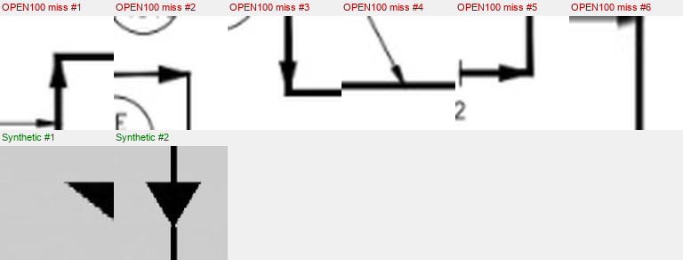

# Arrow A — Root-cause: no-fire misses (subtask 1.7a refinement)

**N = 291 arrow GT boxes in bucket A (NO_FIRE)**  
**OPEN100 Tier 2, 12 real sheets. Synthetic baseline: data/merged/labels/train/**

---

## 1. Pixel-size comparison  (diagonal = √(w² + h²))

**OPEN100 missed arrows (A bucket)** (n=291)

| Stat    | diag_px | w_px | h_px |
|:--------|--------:|-----:|-----:|
| mean    |    16.0 | 11.1 | 11.1 |
| median  |    15.9 | 10.2 | 11.1 |
| p25     |    14.2 |  9.3 |  9.3 |
| p75     |    17.5 | 13.0 | 12.6 |

**Synthetic training arrows (class 23, n=2579)** (n=2579)

| Stat    | diag_px | w_px | h_px |
|:--------|--------:|-----:|-----:|
| mean    |    84.8 | 59.6 | 59.1 |
| median  |    79.2 | 55.0 | 53.0 |
| p25     |    65.1 | 46.0 | 44.0 |
| p75     |    91.9 | 68.0 | 68.0 |

**Size ratio (real median / synth median): 0.200**  
Real arrows are meaningfully smaller than synthetic training arrows.

---

## 2. Orientation distribution of missed arrows

### OPEN100 missed arrows

| Orientation       | Count |      % |
|:------------------|------:|-------:|
| Horizontal         |    55 |   18.9% |
| Vertical           |    61 |   21.0% |
| Square/diagonal    |   175 |   60.1% |
| **Total**          |   291 |    100% |

### Synthetic training arrows (sample)

| Orientation       | Count |      % |
|:------------------|------:|-------:|
| Horizontal         |   338 |   13.1% |
| Vertical           |   309 |   12.0% |
| Square/diagonal    |  1932 |   74.9% |
| **Total**          |  2579 |    100% |

Orientation shift (largest % difference): 9.0 pp

---

## 3. Crop comparison

  
Top row: 6 missed OPEN100 arrows. Bottom row: 2 synthetic training arrows.
Note glyph shape, size, and line weight.

---

## Conclusion

Primary cause(s): **scale**

- scale (real arrows are 0.20× smaller: median diag 15.9 px vs 79.2 px synthetic)

The model's A-bucket rate for arrows (34.9% of all GT) combined with the B rate (26.3%) means the detector produces no useful signal on 61% of real flow arrows. The crops confirm this is not a labelling-convention issue — the arrows simply look different enough from the synthetic glyphs that the model's learned representation does not transfer.
