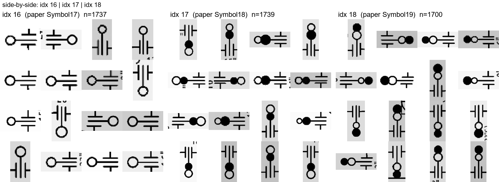
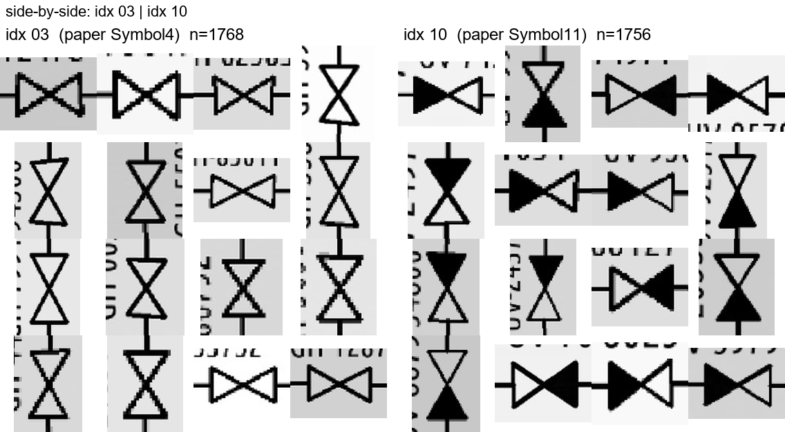

# Phase 1 Detection — Error Analysis

**Model:** YOLOv11s, 50 epochs, 640 px tiles, batch 32 (2×T4 DDP)  
**Test split:** 1 428 tiles, real P&IDs only (no synthetic), held out from training  
**Evaluated:** 2026-06-16  
**Re-keyed to verified class identity:** 2026-06-16 (subtask 1.6b — see
`docs/class_identity/mapping.md`)

> **Why this file changed:** the class names used below at first publication
> (`gate_valve_handwheel`, `butterfly_valve_partial`, etc.) were guessed in
> subtask 0.2, not derived from ground truth — see subtask 1.6a. The metrics
> and per-index numbers in this file are unchanged (this is not a re-eval);
> only the names attached to each index are corrected, and the confused
> pairs below have been re-checked against actual ground-truth crops
> (`docs/class_identity/idx_NN.png`) to confirm they're real visual
> look-alikes and not just classes that happened to share a guessed name.

---

## Overall test-split metrics

| Metric | Value |
|---|---|
| mAP@50 | **0.994** |
| mAP@50-95 | **0.985** |
| Precision | 0.995 |
| Recall | 0.988 |

Phase 1 gate (**recall ≥ 0.85**): **PASSED** overall. Two individual classes fall below — see below.

---

## 5 weakest classes (test split, sorted by AP@50 then AP@50-95)

Numbers are unchanged from the original eval; only the name column is corrected. The
"originally called" column is kept so anyone cross-referencing an older note can still find
their way — see `docs/class_identity/mapping.md` for the full per-index evidence.

| Rank | idx | Verified name | AP@50 | AP@50-95 | Recall | Originally called | Notes |
|---|---|---|---|---|---|---|---|
| 1 | 16 | `Symbol_17` | 0.980 | 0.960 | **0.865** | ~~gate_valve_handwheel~~ | Only class below Phase 1 recall gate. Double-bar + single hollow-circle symbol — **not** a handwheel valve; see below. |
| 2 | 10 | `Symbol_11` | 0.985 | 0.982 | 0.969 | ~~butterfly_valve_partial~~ | Bowtie with asymmetric fill (one triangle hollow, one solid) |
| 3 | 18 | `Symbol_19` | 0.991 | 0.983 | 0.933 | ~~gate_valve_actuated_dot~~ | Double-bar + two adjacent circles (one filled, one hollow) |
| 4 | 17 | `Symbol_18` | 0.994 | 0.983 | 0.969 | ~~gate_valve_actuated_stem~~ | Double-bar + one hollow and one filled circle |
| 5 | 23 | `flow_arrow` | 0.995 | **0.957** | 0.990 | flow_arrow (unchanged) | Weakest localization (mAP50-95); directional arrows vary in shape |

Honourable mentions by mAP@50-95 (localization quality):

| idx | Verified name | AP@50-95 | Originally called |
|---|---|---|---|
| 29 | `tag_rectangle_simple` | 0.955 | tag_rectangle_simple (unchanged — verified correct, see subtask 1.6a) |
| 23 | `flow_arrow` | 0.957 | flow_arrow (unchanged) |
| 16 | `Symbol_17` | 0.960 | ~~gate_valve_handwheel~~ |
| 20 | `Symbol_21` | 0.967 | ~~spectacle_blind_spacer~~ |
| 31 | `tag_rectangle_multiline` | 0.968 | tag_rectangle_multiline (unchanged) |

**The headline correction:** the class that actually failed the Phase 1 recall gate (idx 16,
recall 0.865) is not a gate valve at all. Indices 16/17/18 are a family of double-parallel-bar
symbols decorated with hollow/filled circles (paper `Symbol17/18/19`) — visually closer to a
spectacle-blind/line-blind fitting than to any valve. The real handwheel/manual-actuator glyph
in this dataset is idx 6 (`valve_handwheel`), which is not weak (AP@50-95 not in the bottom 5).

---

## Most-confused class pairs — re-checked against ground truth

The original analysis named these pairs using the guessed names; below, each pair is re-keyed
to its verified identity and visually re-confirmed by pasting the actual ground-truth contact
sheets side by side (`docs/class_identity/idx_NN.png`), so we can see whether the model is
failing on genuine look-alikes or whether the original pairing was just two classes that
happened to share a guessed name.

### 1. idx 16 / 17 / 18 (`Symbol_17` / `Symbol_18` / `Symbol_19`) — **real, confirmed**

Originally written up as "`gate_valve_handwheel` ↔ `gate_valve_actuated_stem` /
`gate_valve_actuated_dot`". The confusion-matrix block at these three indices is the largest
off-diagonal mass in the whole matrix (`runs/detect/train/eval_test/confusion_matrix.png`,
rows/cols 16-18).

Looking at the crops directly: all three are the **same double-bar base shape**, differing
only by which circle (hollow / filled / both) sits at the ends. This is a genuine fine-grained
problem — the distinguishing mark is small, low-contrast, and easy for a detector to miss at
640px tile scale, exactly like the original write-up described, just with the wrong object
identity attached. **Confirmed real — this is the idx 16/17/18 family, not a gate-valve
family, and it is a legitimate Phase 2 target.**

### 2. idx 3 / idx 10 (`Symbol_4` / `Symbol_11`) — **real, but weaker and one-directional**

Originally written up as "`butterfly_valve_partial` ↔ `butterfly_valve_open` /
`butterfly_valve_open_v2`" (i.e. idx 10 vs. both idx 0 and idx 3).

Re-checking the confusion matrix directly: there is a visible (light, low-magnitude) off-diagonal
cell between idx 3 and idx 10, but **no** visible cell between idx 0 and idx 10 — the original
"vs. both" framing overstated it by one class. The crops confirm why idx 3↔10 is plausible:
idx 3 is a bowtie with both triangles solid-filled, idx 10 is the same bowtie with only one
triangle filled — a genuine partial-fill vs. full-fill ambiguity, not a naming coincidence.
**Confirmed real, but narrower than originally stated: idx 3 ↔ idx 10, not idx 0.**

### 3. idx 23 (`flow_arrow`) — localization only, not a pair

Recall is 0.990 but AP@50-95 is only 0.957 — the weakest localization score across all classes.
This was never a confusion with another class; it's a box-regression issue (flow arrows are
thin directional lines whose "right" box extent is ill-defined). Name was already correct, no
re-keying needed.

The overall confusion matrix diagonal is near-perfect outside the idx 16/17/18 block; the idx
3/10 cell is the only other visible off-diagonal mass found on direct inspection.

---

## OBB (YOLOv11-OBB) assessment

**Not worth it yet.** Reasons:

- Our public training data (HF `hamzas/digitize-pid-yolo` + synthetic) is **axis-aligned only**;
  no oriented-box angle labels exist.
- Adding OBB requires either: (a) re-labelling all source images with angle annotations, or
  (b) generating synthetic sheets with rotation and auto-producing oriented labels — which our
  synth generator can do (it already places glyphs at random rotation) but the label format
  would need to change from YOLO bbox to YOLO OBB.
- The current mAP@50 of **0.994** on the synthetic-distribution test set is already strong;
  the mAP@50 vs mAP@50-95 gap (0.009) is small, indicating boxes are well-localised for
  upright symbols.
- Revisit OBB after the real-world eval set is built — if real sheets with rotated symbols
  show a meaningful recall drop, that is the trigger to invest in OBB labels + retraining.

---

## Recommended next step

**Build the real-world eval set** (`data/realworld_eval/`) before changing the model.

Rationale: the current test split is drawn from the same HF dataset as training — same scanner
vendor, same symbol library, same scale. A 0.994 mAP on this split could be inflated by
distribution similarity. We do not yet know how the model behaves on a genuinely out-of-
distribution P&ID (different company, hand-drawn symbols, faded scans).

Concretely:
1. Hand-label 5–10 real P&ID sheets from a public source (see `docs/realworld_eval_protocol.md`).
2. Run `evaluate.py --realworld` to get an honest out-of-distribution AP table.
3. **If real-world recall drops below 0.7:** scale up to yolo11m + more synth instances for
   weak classes.  
   **If real-world recall stays above 0.85:** proceed directly to Phase 2 (fine-grained
   classifier for the confirmed look-alike groups — idx 16/17/18 and idx 3/10, see above;
   not "gate-valve / butterfly-valve families", those names didn't survive verification).

The single concrete model improvement that is already clearly warranted regardless of
real-world results: **generate 3–5× more synthetic instances for idx 16 (`Symbol_17`)**
(the only class below the recall gate at 0.865) before the next training run.
